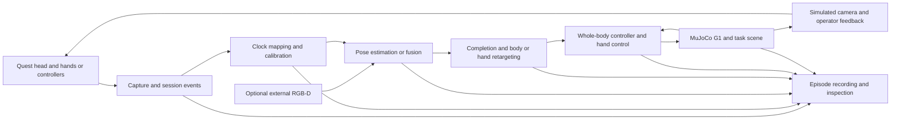

# Architecture And Decisions

[Home](Home.md) | [Conventions](Common-Ground.md) | [Data](Data-and-Evaluation.md)

**Status: proposed.** These are responsibility boundaries and experiments, not
implemented services or a finalized API. The application engine and transport
remain open. Keep alternative implementations comparable through recorded input
and explicit contracts rather than prematurely building a general framework.

## Provisional Data Flow

The optional camera observes the **human operator**. Simulated robot-camera
feedback is a different stream. Do not conflate external human-pose sensing,
Quest passthrough cameras, and MuJoCo task observations.

## Boundary Requirements

| Boundary | Minimum information and behavior |
| --- | --- |
| Capture -> desktop | Input mode, source clock and sequence, poses/buttons or hand joints, validity, source convention and tracking state. |
| Calibration -> estimation | Frame transforms, human scale, calibration ID, recenter epoch and clock mapping with uncertainty. |
| Estimation -> retargeting | Human targets with observed/inferred/fused provenance; confidence only where actually available. |
| Retargeting -> control | Named robot reference layout, frame, units and timestamp; separate body and hand targets. |
| Control -> simulation | Policy/model compatibility, actuator mapping, control rate and actual applied controls. |
| Simulation -> recorder/feedback | Achieved state, contacts/task state, simulator time, frame capture time and session events. |

Logical boundaries may share a process. They do not mandate ROS, Redis, UDP,
WebSocket, WebRTC, separate servers, or a binary schema. The upstream Redis
interface is an adapter candidate, not an immutable FURRY contract.

## Reuse Before Reimplementation

The [XRoboToolkit Quest client](https://github.com/XR-Robotics/XRoboToolkit-Unity-Client-Quest)
is a concrete candidate for head, controller, hand and visual-feedback paths.
Its [README at revision 07a2833](https://github.com/XR-Robotics/XRoboToolkit-Unity-Client-Quest/blob/07a28333341629008187e988b73b48bced316092/README.md)
marks Quest body tracking as coming soon and reports Unity/OpenXR compatibility
limitations. A working PICO path in TWIST2 does not
establish Quest full-body support. Pin the client revision and test each feature
on the device before selecting it.

Compare it with [Meta's Movement samples](https://github.com/oculus-samples/Unity-Movement)
and [native OpenXR samples](https://github.com/meta-quest/Meta-OpenXR-SDK). A minimal
new client is an alternative only if the reuse spike identifies a real gap.
OPEN TEACH and Open-TeleVision are additional references for interaction and
visual feedback, not drop-in whole-body G1 controllers.

## Decision Register

Every entry is **proposed/open**, not accepted. Use the
[ADR template](Contributing.md#decision-record-template).

| Decision | Owner workstream | Evidence required before selection |
| --- | --- | --- |
| ADR-001: Quest client reuse or new app | [Quest #3](https://github.com/emb-ai/FURRY/issues/3) | Both input modes, body-signal availability, deployment, SDK/license constraints and controller-free session controls. |
| ADR-002: Host/runtime, transport and feedback | [Runtime #4](https://github.com/emb-ai/FURRY/issues/4) | Supported hosts, measured delay/dropout, clock mapping, visual feedback and authenticated or isolated network design. |
| ADR-003: Completion and body retargeting | [Motion #5](https://github.com/emb-ai/FURRY/issues/5) | Matched causal baselines, physical tracking results, uncertainty and compute budget. |
| ADR-004: Hand control and embodiment mapping | [Hands #6](https://github.com/emb-ai/FURRY/issues/6) | Body-policy compatibility, achieved hand state, grasp presets versus optical retargeting and contact behavior. |
| ADR-005: Episode storage and replay contract | [Data #8](https://github.com/emb-ai/FURRY/issues/8) | Round-trip prototype, interruption recovery, synchronization, provenance and export requirements. |
| ADR-006: Optional RGB-D estimator/fusion | [RGB-D #7](https://github.com/emb-ai/FURRY/issues/7) | Available device support, calibration residuals, camera-free comparison and failure handling. |

## Failure Behavior To Design

Session control needs explicit disconnected, calibrated/ready, active, paused,
recording and aborted/reset events; the final state machine belongs to ADR-002.
Both input modes must support the same session intentions, though gestures and
buttons need not provide identical dexterity.

Reject or visibly mark invalid/stale targets. Define bounded hold/interpolation
and pause behavior through simulation tests, not indefinite replay of the last
packet. Reconnection must require deliberate resumption after revalidation.
Recenter and simulator reset establish new frame/time epochs. Video failure must
be visible even when pose transport continues.

Do not expose Redis or camera streams publicly. The default baseline is local
loopback; LAN streaming needs an explicit trust boundary, minimal permissions
and connection policy. No physical-robot control process belongs in this design.
